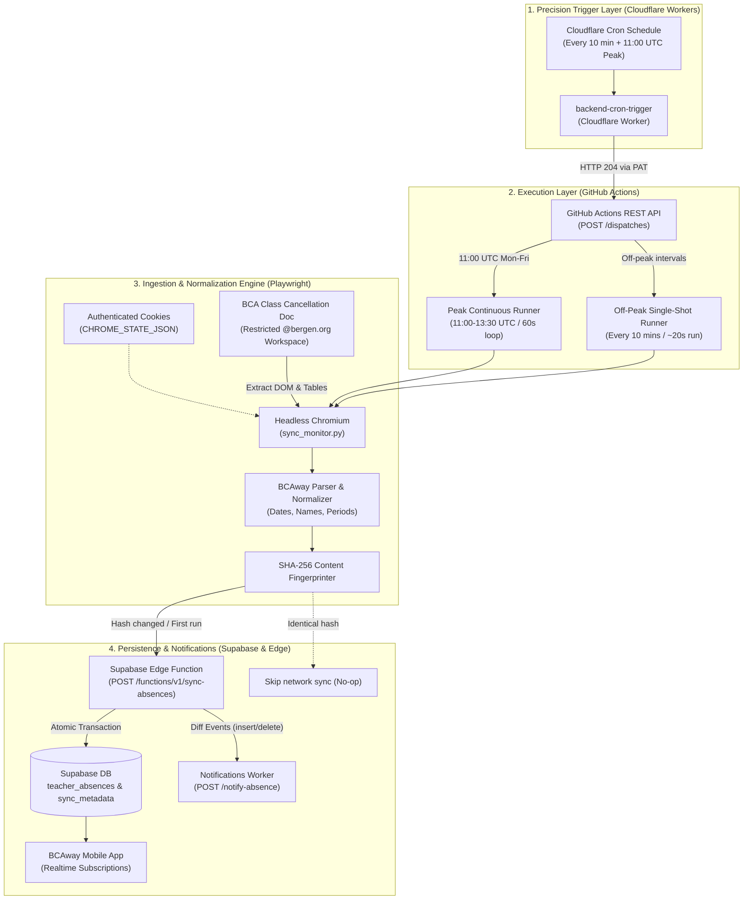

# backend-sync

> **BCAway Backend Sync — Automated Teacher Absence Ingestion Engine**  
> High-performance Python, Cloudflare Workers, and GitHub Actions synchronization pipeline that monitors the BCA Class Cancellation Google Doc, parses attendance schedules to BCAway canonical standards, fingerprints changes with SHA-256 hashing, and updates Supabase in real-time.

---

## 🏛 System Architecture



---

## ⚡ Precision Scheduling Strategy

GitHub Actions native cron schedules (`schedule: [cron: ...]`) are shared globally across GitHub, frequently suffering from significant queuing delays (15–90+ minutes) or missed triggers during high-traffic hours.

To solve this, **BCAway separates scheduling from execution**:
1. **Precision Triggering (`backend-cron-trigger`):** A lightweight Cloudflare Worker running on Cloudflare's global edge network fires every 10 minutes with sub-second precision, dispatching GitHub Actions workflows via the GitHub REST API.
2. **Execution (`backend-sync`):** GitHub Actions Ubuntu runners execute the authenticated Playwright scraper.

### Schedule Rules Matrix

| Time Window (UTC) | Time Window (EDT) | Days | Trigger Mechanism | Target Workflow | Execution Behavior |
| :--- | :--- | :--- | :--- | :--- | :--- |
| **11:00 AM** | 7:00 AM | Mon – Fri | Cloudflare Cron | `teacher_sync_peak.yml` | **Peak Continuous Loop:** Launches a single 150-minute runner that scrapes and syncs every 60 seconds until 13:30 UTC. |
| **11:10 AM – 1:20 PM** | 7:10 AM – 9:20 AM | Mon – Fri | Cloudflare Cron | *None (Skipped)* | **Intelligent No-Op:** Cloudflare detects the continuous peak loop is actively running and skips redundant off-peak dispatches. |
| **1:30 PM – 10:50 AM** | 9:30 AM – 6:50 AM | Mon – Fri | Cloudflare Cron | `teacher_sync_offpeak.yml` | **Off-Peak Periodic:** Dispatches a fast, single-shot sync cycle every 10 minutes. |
| **All Day** | All Day | Sat – Sun | Cloudflare Cron | `teacher_sync_offpeak.yml` | **Weekend Periodic:** Dispatches a single-shot sync cycle every 10 minutes. |

---

## 📋 Master Implementation & Deployment Checklist

Follow this checklist from top to bottom to configure and deploy the entire backend ingestion pipeline:

```text
[ ] Step 1: Capture Google Workspace Session Cookies
[ ] Step 2: Deploy & Configure Supabase Edge Function
[ ] Step 3: Configure GitHub Repository Secrets
[ ] Step 4: Generate GitHub Personal Access Token (PAT)
[ ] Step 5: Deploy backend-cron-trigger Cloudflare Worker
[ ] Step 6: Verify End-to-End Pipeline
```

---

### Step 1: Capture Google Workspace Session Cookies

Because the BCA Class Cancellation Google Doc is restricted to `@bergen.org` accounts, Playwright uses exported browser cookies to bypass Google login:

1. Navigate to the `backend-sync` directory:
   ```bash
   cd backend-sync
   python3 -m venv .venv
   source .venv/bin/activate
   pip install -r requirements.txt
   playwright install chromium
   ```
2. Launch the session capture utility:
   ```bash
   python3 capture_session.py
   ```
3. A Chromium browser will open. Sign in with your authorized `@bergen.org` Google Workspace account and complete any 2FA prompts.
4. Once the document renders in the browser, press **Enter** in your terminal.
5. The script will save your active session state to `chrome_state.json`.

---

### Step 2: Deploy & Configure Supabase Edge Function

1. Ensure the Supabase CLI is authenticated:
   ```bash
   npx supabase login
   npx supabase link --project-ref blbrivnnelwgbthflmio
   ```
2. Deploy the `sync-absences` Edge Function:
   ```bash
   npx supabase functions deploy sync-absences --no-verify-jwt
   ```
3. Generate a strong synchronization secret:
   ```bash
   openssl rand -base64 64
   ```
4. Set required secrets in Supabase:
   ```bash
   npx supabase secrets set SYNC_SECRET="<YOUR_SECRET>"
   npx supabase secrets set NOTIFICATIONS_WORKER_URL="https://bcaway-notifications.tjaynj.workers.dev"
   ```

---

### Step 3: Configure GitHub Repository Secrets

In GitHub, open `bcaway/backend-sync` $\rightarrow$ **Settings** $\rightarrow$ **Secrets and variables** $\rightarrow$ **Actions** $\rightarrow$ **New repository secret**.

Add the following secrets:

| Secret Name | Required | Description | Example / Source |
| :--- | :---: | :--- | :--- |
| `CHROME_STATE_JSON` | **Yes** | Entire raw JSON content of `chrome_state.json` from Step 1. | `{"cookies": [...], "origins": [...]}` |
| `SUPABASE_URL` | **Yes** | Your Supabase project URL. | `https://blbrivnnelwgbthflmio.supabase.co` |
| `SYNC_SECRET` | **Yes** | The exact bearer secret generated and saved in Supabase in Step 2. | `<YOUR_SECRET>` |
| `GOOGLE_DOC_URL` | *Optional* | BCA Published Google Doc URL. | Defaults to official document if omitted. |

---

### Step 4: Generate GitHub Personal Access Token (PAT)

This token allows the Cloudflare Worker to trigger GitHub Actions workflows:

1. Go to [GitHub Token Settings](https://github.com/settings/tokens?type=beta) (Fine-grained tokens recommended):
   * **Token name:** `bcaway-cron-trigger`
   * **Expiration:** As desired (e.g. 90 days or 1 year)
   * **Repository access:** **Only select repositories** $\rightarrow$ choose `bcaway/backend-sync`
   * **Permissions:** Under **Repository permissions**, set **Actions** to **Read and write**
2. Generate and copy the token (`github_pat_...`).  
   *(A classic token with `repo` or `workflow` scope also works).*

---

### Step 5: Deploy `backend-cron-trigger` Cloudflare Worker

1. Navigate to the `backend-cron-trigger` repository:
   ```bash
   cd ../backend-cron-trigger
   npm install
   ```
2. Save the GitHub token as an encrypted secret in Cloudflare:
   ```bash
   npx wrangler secret put GH_DISPATCH_TOKEN
   ```
   *(Paste your GitHub PAT when prompted)*.
3. Deploy the worker to Cloudflare's global edge:
   ```bash
   npm run deploy
   ```
4. Cloudflare will deploy the worker and immediately register the cron schedule:
   ```text
   Cron Triggers:
     - */10 * * * *
   ```

---

### Step 6: Verify End-to-End Pipeline

1. **Test the Cloudflare Trigger Endpoint:**
   Visit your deployed worker URL in a browser or run:
   ```bash
   curl https://backend-cron-trigger.<your-subdomain>.workers.dev/
   ```
   You will receive the system health report and current schedule context:
   ```json
   {
     "service": "BCAway Backend Cron Trigger",
     "status": "operational",
     "time": { "utc": "...", "eastern": "...", "weekday": true },
     "nextCronAction": { "type": "dispatch_offpeak", "workflow": "teacher_sync_offpeak.yml" }
   }
   ```
2. **Trigger a Manual Sync Dispatch via Cloudflare:**
   ```bash
   curl -X POST "https://backend-cron-trigger.<your-subdomain>.workers.dev/trigger?workflow=offpeak&force=true"
   ```
3. **Verify in GitHub Actions:**
   * Go to `bcaway/backend-sync` $\rightarrow$ **Actions**.
   * You will see **BCA Teacher Absence Sync (Off-Peak)** running.
   * View the logs to confirm:
     ```text
     Parsed N absence(s) for YYYY-MM-DD
     Submitting N record(s) to Supabase (/functions/v1/sync-absences)...
     Supabase sync accepted (200)
     ```
4. **Verify in Supabase & BCAway App:**
   * Check the `teacher_absences` and `sync_metadata` tables in Supabase.
   * Open the BCAway mobile app — absences render immediately via Supabase Realtime!

---

## 🛠 Local Development & Testing

You can run the sync engine locally using a `.env` file:

```bash
# 1. Copy sample environment file
cp .env.example .env

# 2. Fill in your credentials in .env
# SUPABASE_URL=https://blbrivnnelwgbthflmio.supabase.co
# SYNC_SECRET=your_sync_secret

# 3. Run a single-shot test
python3 sync_monitor.py --once

# 4. Force push regardless of hash
python3 sync_monitor.py --once --force

# 5. Run continuous monitor locally (e.g. 10s intervals for testing)
python3 sync_monitor.py --continuous --interval 10
```

---

## 📋 Parsing Rules & BCAway Normalization

The parsing engine enforces strict normalization across all data:

1. **Header Date Parsing:**
   * Looks for `BCA Class Cancellation List \n {Month} {Day}, {YYYY}`.
   * Automatically heals split-span digit tokens (e.g. `2 026` or fragmented day digits).
   * Normalizes to ISO `YYYY-MM-DD`.
   * Falls back to the current date in US Eastern time if the header is absent.
2. **Table Parsing:**
   * Discards header rows (`Teacher`, `Period`, etc.).
   * Column 0: Normalized Teacher Name.
   * Column 1: Period string.
3. **Period Normalization:**
   * `"all"` / `"all day"` $\rightarrow$ `"igs, 1, 2, 3, 4, 5, 6, 7, 8, 9"`
   * Ranges (`"1-3"`) $\rightarrow$ `"1, 2, 3"`
   * Standalone numbers (`"5"`) $\rightarrow$ `"5"`
   * `"igs"` $\rightarrow$ Always ordered first
   * Connectors (`"through"`, `"to"`, `"&"`, `"+"`) $\rightarrow$ parsed into individual periods.
4. **Deterministic SHA-256 Hashing:**
   * Absences are sorted deterministically and hashed.
   * Redundant Supabase database updates and duplicate push notifications are skipped if the content hash has not changed.

---

## 🔍 Debugging & Troubleshooting

### Expired Session Cookies
If Google invalidates the session or cookies expire:
* The engine detects the Google ServiceLogin redirect, logs `Authentication wall detected! Google Workspace session has expired.`, and saves debug files to `.debug/`.
* The GitHub Actions workflow automatically uploads `debug_last_page.html` as a downloadable artifact.
* **Fix:** Re-run `python3 capture_session.py` on your computer and update the `CHROME_STATE_JSON` GitHub repository secret.

### Inspecting Workflow Artifacts
Whenever a workflow run fails or encounters an unexpected page structure, download the `debug-artifacts` zip from the GitHub Actions run summary page to inspect the exact HTML received by Chromium.
