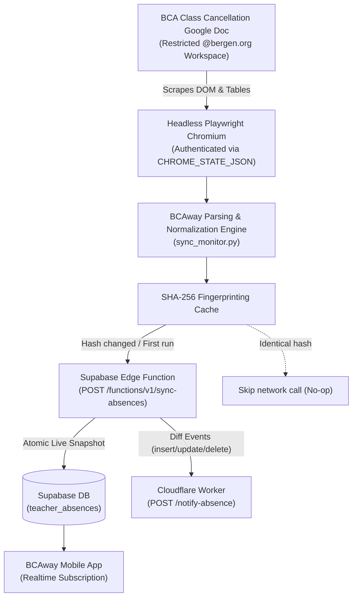

# backend-sync

> **BCAway Backend Sync — Automated Teacher Absence Ingestion Engine**  
> High-performance Python & GitHub Actions synchronization pipeline that monitors the BCA Class Cancellation Google Doc, parses attendance schedules to BCAway canonical standards, fingerprints changes with SHA-256 hashing, and updates Supabase in real-time.

---

## 🏛 System Architecture



---

## ⚡ Scheduling Strategy & GitHub Actions Optimization

GitHub Actions has a 5-minute minimum cron resolution and VM boot overhead (30–60s per runner). Spawning 150 separate VMs across the morning rush would quickly exhaust GitHub Actions quota.

To achieve **true 1-minute resolution without hitting limits or burning runner minutes**, this workflow uses a two-tier hybrid model:

### 1. Morning Peak Window (11:00 AM UTC – 1:30 PM UTC)
* **Local School Time:** 7:00 AM – 9:30 AM EDT *(or 6:00 AM – 8:30 AM EST)*.
* **Execution:** A single GitHub Actions runner launches at **11:00 UTC** (`cron: '0 11 * * 1-5'`) and enters an internal continuous polling loop (`--continuous --interval 60`).
* **Interval:** Every **60 seconds** (1 minute), the engine scrapes the doc, computes the hash, and pushes changes if detected.
* **Runtime Efficiency:** Takes advantage of the single ~150-minute job window (well within GitHub’s 360-minute per-job hard limit). Spawns exactly **1 job** instead of 150 VMs, eliminating queue delays and VM boot latency.

### 2. Off-Peak Window (Any Other Time)
* **Execution:** Runs every **10 minutes** (`cron: '*/10 * * * *'`).
* **Smart Skip:** If the 10-minute trigger fires during the 11:00–13:30 UTC window, it evaluates `should_run=false` and immediately exits in under 2 seconds, preventing collisions with the peak worker.
* **Interval:** Outside the peak window, it executes a single-shot check (`--once`), parses the document, and terminates in ~5 seconds.

---

## 🚀 Setup & Deployment Guide

### Step 1: Capture Google Workspace Session Cookies

Because the official BCA Class Cancellation Google Doc is restricted to `@bergen.org` accounts, Playwright uses exported browser session cookies to bypass the Google login wall.

Start a virtual Python Enviornment:
```bash
# 1. Clone or navigate to the repository
cd backend-sync

# 2. Create a virtual enviornment
python3 -m venv .venv

# 3. Activate the virtual enviornment
source .venv/bin/activate
```

Run the interactive session capture utility locally on your computer:

```bash
# 1. Install dependencies
python3 -m pip install -r requirements.txt
playwright install chromium

# 2. Launch the session capture helper
python3 capture_session.py
```

1. A Chromium browser window will open.
2. Sign in with your authorized `@bergen.org` Google Workspace account and complete any two-factor authentication prompts.
3. Once the document renders in the browser, return to your terminal and press **Enter**.
4. The script will export your session to `chrome_state.json`.

Deactivate the venv afterwards:
```bash
deactivate
```
---

### Step 2: Configure GitHub Repository Secrets

Go to your repository on GitHub:  
**Settings** $\rightarrow$ **Secrets and variables** $\rightarrow$ **Actions** $\rightarrow$ **New repository secret**.

Add the following secrets:

| Secret Name | Required | Description | Example / Source |
| :--- | :---: | :--- | :--- |
| `CHROME_STATE_JSON` | **Yes** | Entire content of `chrome_state.json` exported in Step 1. | `{"cookies": [...], "origins": [...]}` |
| `SUPABASE_URL` | **Yes** | Your Supabase project URL. | `https://xyzcompany.supabase.co` |
| `SYNC_SECRET` | **Yes** | Bearer secret for `/functions/v1/sync-absences`. | Configured in Supabase Edge Functions. |
| `GOOGLE_DOC_URL` | *Optional* | Published Google Doc URL. | Defaults to BCA's published cancellation doc if omitted. |

---

### Step 3: Test & Verify

1. In GitHub, navigate to the **Actions** tab.
2. Select **BCA Teacher Absence Sync** from the left sidebar.
3. Click **Run workflow**:
   * Mode: `once` (runs a single scrape cycle).
   * Force: `true` (forces a push to Supabase to verify connectivity).
4. Check the workflow logs. You should see:
   ```text
   Parsed N absence(s) for YYYY-MM-DD
   Submitting N record(s) to Supabase (/functions/v1/sync-absences)...
   Supabase sync accepted (200)
   ```
5. Check your BCAway mobile app — today's absences will appear instantly via Supabase Realtime!

---

## 🛠 Local Development & Testing

You can run and test the engine locally using a `.env` file:

```bash
# 1. Copy sample environment file
cp .env.example .env

# 2. Fill in your credentials in .env
# SUPABASE_URL=...
# SYNC_SECRET=...

# 3. Run a single-shot test
python3 sync_monitor.py --once

# 4. Force push regardless of hash
python3 sync_monitor.py --once --force

# 5. Run continuous monitor locally (e.g. 10s intervals for testing)
python3 sync_monitor.py --continuous --interval 10
```

---

## 📋 Parsing Rules & BCAway Normalization

The parsing engine mirrors BCAway's period and teacher normalization rules:

1. **Header Date Parsing:** Matches `BCA Class Cancellation List \n {Month} {Day}, {YYYY}` and converts to ISO `YYYY-MM-DD`. Falls back to current date in `America/New_York` if the header is missing.
2. **Table Parsing:** Discards table header rows (`Teacher`, `Period`, etc.), maps Column 0 to teacher name, and Column 1 to periods impacted.
3. **Period Normalization:**
   * `"all"` / `"all day"` $\rightarrow$ `"igs, 1, 2, 3, 4, 5, 6, 7, 8, 9"`
   * Ranges (`"1-3"`) $\rightarrow$ `"1, 2, 3"`
   * Standalone periods (`"5"`) $\rightarrow$ `"5"`
   * `"igs"` $\rightarrow$ Always ordered first
   * Connectors (`"through"`, `"to"`, `"&"`, `"+"`) are normalized to standard delimiters.
4. **Deterministic Hashing:** Absences are sorted alphabetically by teacher and hashed using SHA-256. Redundant Supabase calls and duplicate push notifications are skipped if the content hasn't changed.

---

## 🔍 Debugging & Troubleshooting

### Expired Session Cookies
If Google invalidates the session or cookies expire:
* The workflow will detect the Google ServiceLogin redirect, log `Authentication wall detected! Google Workspace session has expired.`, and save debug files to `.debug/`.
* The GitHub Actions workflow automatically uploads `debug_last_page.html` as a downloadable artifact.
* **Fix:** Re-run `python3 capture_session.py` on your computer and update the `CHROME_STATE_JSON` GitHub secret.

### Inspecting Artifacts
Whenever a workflow run fails or encounters an unexpected page structure, download the `debug-artifacts` zip from the GitHub Actions run summary page to inspect the exact HTML received by Chromium.
